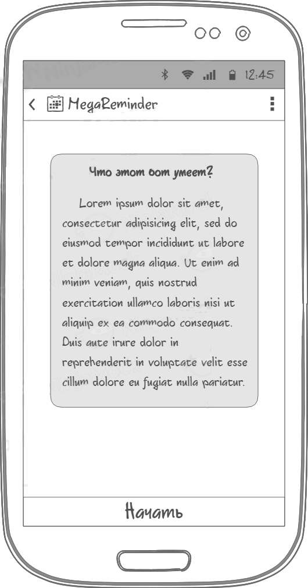
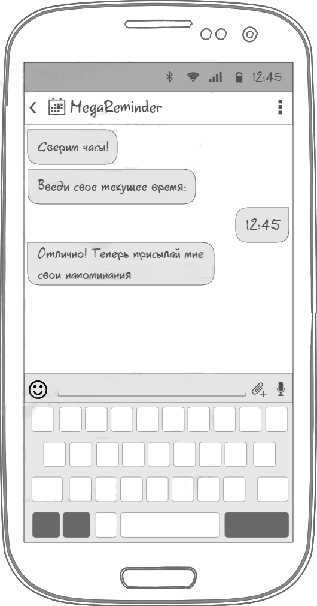
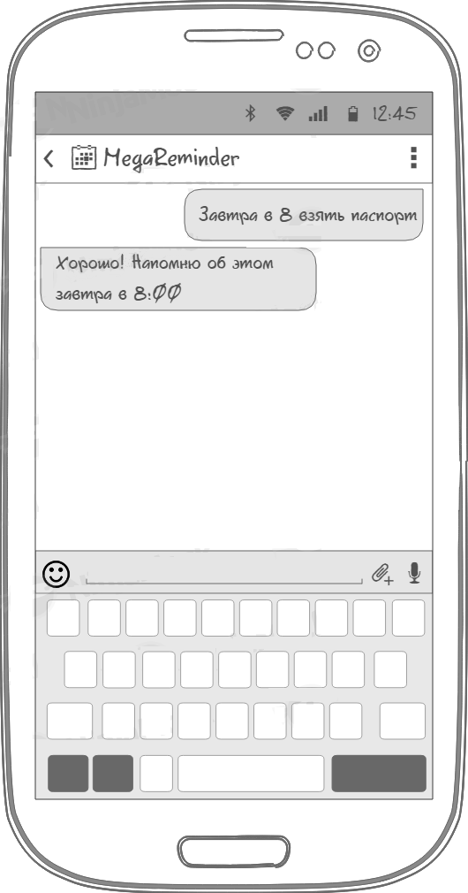

# Требования к проекту
---

# Содержание
1 [Введение](#intro)  
1.1 [Назначение](#appointment)  
1.2 [Бизнес-требования](#business_requirements)  
1.2.1 [Исходные данные](#initial_data)  
1.2.2 [Возможности бизнеса](#business_opportunities)  
1.2.3 [Границы проекта](#project_boundary)  
1.3 [Аналоги](#analogues)  
2 [Требования пользователя](#user_requirements)  
2.1 [Программные интерфейсы](#software_interfaces)  
2.2 [Интерфейс пользователя](#user_interface)  
2.3 [Характеристики пользователей](#user_specifications)  
2.3.1 [Аудитория приложения](#application_audience)  
2.4 [Предположения и зависимости](#assumptions_and_dependencies)  
3 [Системные требования](#system_requirements)  
3.1 [Функциональные требования](#functional_requirements)  
3.1.1 [Основные функции](#main_functions)  
3.1.1.1 [Установка часового пояса](#user_time_zone)  
3.1.1.2 [Добавление нового напоминания](#add_new_remind)  
3.1.1.3 [Редактирование напоминания](#edit_remind)  
3.1.1.4 [Просмотр напоминаний](#list_reminds)  
3.1.1.5 [Откладывание напоминаний](#readd_remind)  
3.1.1.6 [Напоминания с файлами](#file_remind)  
3.1.1.7 [Переадресация напоминаний](#send_external)  
3.1.1.8 [Разрешение чужих напоминаний](#allow_external)  
3.1.2 [Ограничения и исключения](#restrictions_and_exclusions)  
3.2 [Нефункциональные требования](#non-functional_requirements)  
3.2.1 [Атрибуты качества](#quality_attributes)  
3.2.1.1 [Требования к удобству использования](#requirements_for_ease_of_use)  
3.2.1.2 [Требования к безопасности](#security_requirements)  

<a name="intro"/>

# 1 Введение

<a name="appointment"/>

## 1.1 Назначение
Этот документ является основным источником с требованиями к боту « MegaReminder бот» для Telegram.

<a name="business_requirements"/>

## 1.2 Бизнес-требования

<a name="initial_data"/>

### 1.2.1 Исходные данные
Людям всех возрастных категорий свойственно откладывать дела на потом (в силу обстоятельств или других причин), а затем забывать об их существовании и попадать в неприятные ситуации. Распространенным решением проблемы являются крестики на руках, но что если дел несколько, как узнать какой крестик за что отвечает? Другим решением может стать блокнот, и многим людям этого достаточно, но в современном мире у людей под рукой лишь смартфон. Существует огромное количество приложений для заметок, однако все они плохи тем, что являются отельными приложениями и далеко не факт, что пользователь захочет или вспомнит о нем. Однако есть такое приложение, которое постоянно открыто практически у любого современного человека - мессенджер. Человек практически гарантированно увидит и прочитает новое сообщение, а что если это сообщение будет от него самого из прошлого и содержать отложенные дела? 

<a name="business_opportunities"/>

### 1.2.2 Возможности бизнеса
Многие люди желают иметь сервис, который будет напоминать им об отложенных задачах, делах по работе, праздниках в удобной и легкодоступной форме. Способ установки напоминаний должен быть максимально простым и похожим на простую переписку, для удобства использования.

<a name="project_boundary"/>

### 1.2.3 Границы проекта
Приложение «MegaReminder бот» позволит пользователям Telegram устанавливать себе напоминания в виде входящих сообщений.

<a name="analogues"/>

## 1.3 Аналог

## [SkeddyBot](http://telegram.me/skeddybot)

**Русский интерфейс:**  Есть
#### Плюсы:
   * Простой интерфейс добавления напоминаний
   * Список всех напоминаний
   * Веб интерфейс
   
#### Минусы:
   * Большое количество действий для базовых задач   

<a name="user_requirements"/>

# 2 Требования пользователя

<a name="software_interfaces"/>

## 2.1 Программные интерфейсы
Приложение должно работать в Telegram клиенте версии не ниже 6.0.0. В приложении должен использоваться Telegram Bot API версии 6.2. Должно быть написано на языка Python 3.10 и данных храниться в базе данных SQLite версии 3.39.4.

<a name="user_interface"/>

## 2.2 Интерфейс пользователя
При запуске должен отражаться диалог приветствия.  
  

После диалога приветствия должен отражаться диалог первичной настройки.  
  

Так должен выглядеть диалог добавления напоминания.  
  

<a name="user_specifications"/>

## 2.3 Характеристики пользователей

<a name="application_audience"/>

### 2.3.1 Аудитория приложения
Люди любой возрастной категории, зарегистрированные в Telegram.

<a name="assumptions_and_dependencies"/>

## 2.4 Предположения и зависимости
1. Приложение не работает при отсутствии подключения к Интернету;
2. Приложение не работает при отсутствии Telegram;
<a name="system_requirements"/>

# 3 Системные требования

<a name="functional_requirements"/>

## 3.1 Функциональные требования

<a name="main_functions"/>

### 3.1.1 Основные функции

<a name="user_time_zone"/>

#### 3.1.1.1 Установка часового пояса
**Описание.** Пользователь имеет возможность синхронизировать свое локальное время со временем сервера.

| Функция | Требования | 
|:---|:---|
| Установка часового пояса пользователя | Приложение должно запросить текущее время и само установить необходимый часовой пояс |

<a name="add_new_remind"/>

#### 3.1.1.2 Добавление нового напоминания
**Описание.** Пользователь имеет возможность добавления нового напоминания
 
| Функция | Требования | 
|:---|:---|
| Добавление напоминания | Приложение должно добавить в базу новое напоминание в ответ на сообщение пользователя, содержащее его. В случае некорректного сообщения, приложение должно сообщить об этом.|

<a name="edit_remind"/>

#### 3.1.1.3 Редактирование напоминания
**Описание.** Пользователь имеет возможность редактирования напоминания
 
| Функция | Требования | 
|:---|:---|
| Редактирование напоминания | Приложение должно иметь возможность редактирования и удаления напоминания.|

<a name="list_reminds"/>

#### 3.1.1.4 Просмотр напоминаний
**Описание.**  Пользователь имеет возможность просмотреть все добавленные им напоминания.

| Функция | Требования | 
|:---|:---|
| Просмотр напоминаний | Приложение должно вывести информацию о всех напоминаниях когда-либо добавленных пользователем, или о напоминаниях на конкретный день, который укажет пользователь. |

<a name="readd_remind"/>

#### 3.1.1.5 Откладывание напоминаний
**Описание.** Пользователь имеет возможность отложить напоминание.

| Функция | Требования | 
|:---|:---|
| Откладывание напоминаний | Приложение должно предложить пользователю отложить напоминание и повторить его спустя указанное время. |

<a name="file_remind"/>

#### 3.1.1.6 Напоминания с файлами
**Описание.** Пользователь имеет возможность отправить себе в качестве напоминания файл или фотографию.

| Функция | Требования | 
|:---|:---|
| Напоминания с файлами | Приложение должно иметь возможность прислать пользователю отправленный им с заранее документ или фотографию. |

<a name="send_external"/>

#### 3.1.1.7 Переадресация напоминаний
**Описание.** Можно отправлять напоминание другому человеку.

| Функция | Требования | 
|:---|:---|
| Переадресация напоминаний | Приложение должно иметь возможность отправлять напоминание другому пользователю Telegram, если пользователь попросит об этом. |

<a name="allow_external"/>

#### 3.1.1.8 Разрешение чужих напоминаний
**Описание.** Можно разрешить напоминания, присылаемые от другого человека.

| Функция | Требования | 
|:---|:---|
| Разрешение чужих напоминаний | Приложение должно иметь возможность не переадресовывать напоминания, если пользователь не разрешил их прием от конкретного пользователя. |

<a name="restrictions_and_exclusions"/>

### 3.1.2 Ограничения и исключения
1. Приложение работает только при наличии подключения к Интернету;
2. Приложение не работает при отсутствии Telegram;
<a name="non-functional_requirements"/>

## 3.2 Нефункциональные требования

<a name="quality_attributes"/>

### 3.2.1 Атрибуты качества

<a name="requirements_for_ease_of_use"/>

#### 3.2.1.1 Требования к удобству использования
1. Способ добавления напоминаний должен быть похож на обыкновенную переписку и не иметь строгой структуры;
2. Обратная связь с пользователем

<a name="security_requirements"/>

#### 3.2.1.2 Требования к безопасности
1. Приложение предоставляет возможность просмотра и редактирования напоминаний только активного пользователя.
2. Приложение позволяет запертить прием чужих напоминаний.
